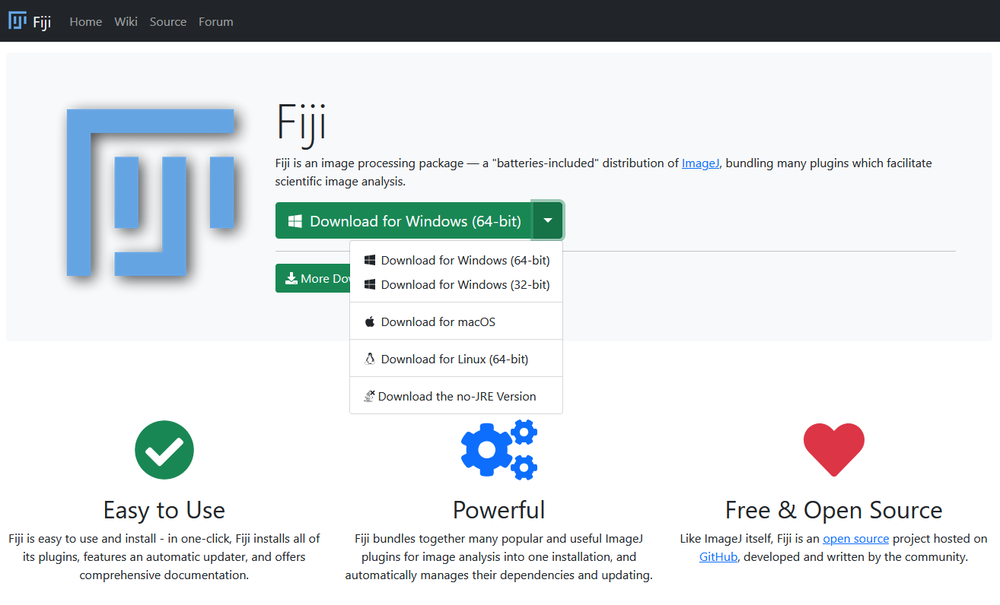

# Preparation For Introduction to Image Analysis Workshop

Please read the following instructions carefully to prepare for the workshop. Completing these steps prior to the workshop is essential to ensure we stay on schedule. If you are having any trouble with the below instructions, please reach out for help:
* Fiji: Sara (sara.salgueirotorres@crick.ac.uk)
* conda: Stefania (stefania.marcotti@crick.ac.uk)


## Download Demo Data

Download the workshop data by clicking on the link to the ZIP archive at the top of this page.

## Installing FIJI

1. Download FIJI from [here](https://fiji.sc/).

   

2. To avoid any permissions issues, install FIJI in your home directory:
   * PC: `C:\users\<your user name>`
   * Mac: `/Users/<your user name>`

   > **WARNING: FIJI *must* be installed in a location where it has write permission - otherwise, it cannot update itself**

3. Start FIJI and allow the updater to run:

   

4. (Optional) If the updater does not run automatically, select `Help > Update`:

   

5. If FIJI produces any error messages, it is most likely because it does not have the necessary permissions to update itself - return to step #2 and double-check the location of the installation.

## Installing conda

1. Install Miniconda by following the installation instructions for your operating system at [this page](https://www.anaconda.com/docs/getting-started/miniconda/install), under the `Basic installation instructions` section. You can ignore the optional step 2.
2. [Windows users only] At step 8 of the installation, make sure to select "Register Miniconda3 as my default Python 3.12" if not already selected.

   
   
3. Please check that the installation worked properly by opening the Terminal (MacOS) or Anaconda PowerShell Prompt (Windows) and typing `conda list`. If conda has been installed correctly, a list of installed packages appears.

### What should I do if I already have `conda` installed on my machine?

Please make sure that your `conda` installation is up to date. To do so, run the following command:
```
conda --version
```
If this returns a version older than `23.10.0`, please update your `conda` by running:
```
conda update -n base conda
```
Should this command throw an error, please contact us!