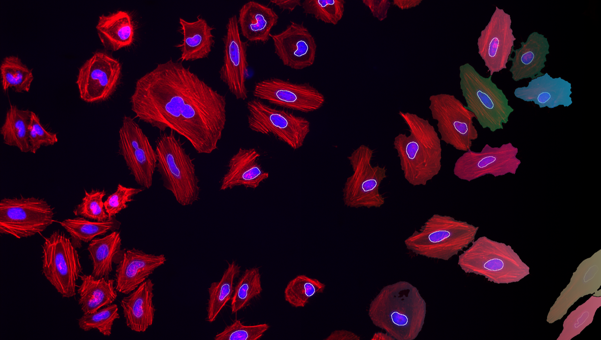

### 3rd - 5th June 2026, Francis Crick Institute

# Overview

In this workshop, we will bridge the gap between advanced microscopy data generation and the computational skills required for its analysis. By leveraging open-source tools like [FIJI](https://fiji.sc), [Jupyter notebooks](https://jupyter.org/) and [napari](https://napari.org), participants will learn to automate image analysis, enhancing the precision, efficiency, and reproducibility of their research. This three-day event, led by experienced core facility staff from the Francis Crick Institute, offers a practical approach to mastering quantitative analysis and workflow automation, essential for advancing research across multiple domains.

# Registration

This workshop is open to internal attendees only. [Registration is currently open on Workday](https://wd3.myworkday.com/crick/learning/offering/ae0d34f84e1c1001909af160a8860000?type=7c48590b5257100009485b7a25ae0068).

# Instructors
* [Dave Barry, Francis Crick Institute](https://www.crick.ac.uk/research/find-a-researcher/david-barry)
* [Deniz Bekat, Francis Crick Institute](https://www.crick.ac.uk/research/find-a-researcher/deniz-bekat)
* [Martin Jones, Francis Crick Institute](https://www.crick.ac.uk/research/find-a-researcher/martin-jones)
* [Sara Salgueiro Torres, Francis Crick Institute](https://www.crick.ac.uk/research/find-a-researcher/sara-salgueiro-torres)
* [Stefania Marcotti, Francis Crick Institute](https://www.linkedin.com/in/stefania-marcotti/)

# Preparation

1. Please remember to bring your laptop (and charger).
2. Ensure your laptop can connect to WiFi networks outside your host institute ([eduroam](https://eduroam.org/) would be ideal) - check with your local IT support team if you're not sure.
3. Please install the required software before the workshop - follow the installation instructions on [this page](Pages/Installation-Instructions.md).
4. Download the workshop data by clicking on the link to the ZIP archive at the top of this page.
5. You will be assigned to a specific group, with whom you will be sitting - your group number will be displayed in the training room.
6. **PLEASE CONTACT US BEFORE THE WORKSHOP IF YOU ENCOUNTER ANY DIFFICULTIES WITH ANY OF THE ABOVE.**

# Program

<table style="width:100%">
	<tbody>
		<tr>
			<th colspan=3>Wednesday, June 3rd 2026</th>
		</tr>
		<tr>
			<td>09:00 - 10:30</td>
			<td>Session 1</td>
			<td>
Introduction & Installations
</td>
		</tr>
		<tr>
			<td></td>
			<td colspan=3>
				<ul>
					<li>Sara Salgueiro Torres</li>
					<ul><li>Who are you and why are you here?</li></ul>
					<li>Stefania Marcotti</li>
					<ul><li>Creating Python environments</li></ul>
					<li>Sara Salgueiro Torres</li>
					<ul>
						<li>Why manual analysis is a bad idea</li>
						<li>Embracing uncertainty</li>
						<li>What is metadata and why do you need it</li>
					</ul>
				</ul>
			</td>
		</tr>
		<tr>
			<td>10:30 - 10:45</td>
			<td colspan=2>Coffee Break</td>
		</tr>
		<tr>
			<td>10:45 - 12:15</td>
			<td>Session 2</td>
			<td>
Image Pre-Processing, Segmentation & Analysis
</td>
		</tr>
		<tr>
			<td></td>
			<td colspan=3>
				<ul>
					<li>Sara Salgueiro Torres</li>
					<ul>
						<li>Basic segmentation using thresholding</li>
						<li>Use of filtering to suppress noise</li>
						<li>Obtaining numbers from images</li>
						<li>Counting and quantifying morphology of objects</li>
						<li>Quantifying fluorescence intensities</li>
					</ul>
				</ul>
			</td>
		</tr>
		<tr>
			<td>12:15 - 13:15</td>
			<td colspan=2>Lunch</td>
		</tr>
		<tr>
			<td>13:15 - 14:45</td> 
			<td>Session 3</td>
			<td>
Extending Analyses to Three Dimensions
</td>
		</tr>
		<tr>
			<td></td>
			<td colspan=3>
			<ul>
				<li>Dave Barry</li>
				<ul>
					<li>Counting and quantifying morphology of three-dimensional objects</li>
					<li>Quantifying fluorescence intensities of three-dimensional objects</li>
				</ul>
			</ul>
			</td>
		</tr>
		<tr>
			<td>14:45 - 15:00</td>
			<td colspan=2>Coffee Break</td>
		</tr>
		<tr>
			<td>15:00 - 17:00</td> 
			<td>Session 4</td>
			<td>
Getting Started with Automating Analysis
</td>
		</tr>
		<tr>
			<td></td>
			<td colspan=3>
			<ul>
				<li>Sara Salgueiro Torres</li>
				<ul>
					<li>Fiji macro language</li>
					<li>Automating batch analyses</li>
				</ul>
			</ul>
			</td>
		</tr>
		<tr>
			<th colspan=3>Thursday, June 4th 2026</th>
		</tr>
		<tr>
			<td>09:00 - 10:30</td>
			<td>Session 5</td>
			<td>
Napari for Image Visualisation
</td>
		</tr>
		<tr>
			<td></td>
			<td colspan=3>
				<ul>
				<li>Martin Jones</li>
				<ul>
					<li>Napari GUI and plugins</li>
					<li>Visualising complex image datasets using napari</li>
				</ul>
				</ul>
			</td>
		</tr>
		<tr>
			<td>10:30 - 10:45</td>
			<td colspan=2>Coffee Break</td>
		</tr>
		<tr>
			<td>10:45 - 12:15</td>
			<td>Session 6</td>
			<td>
Improving Reproducibility
</td>
		</tr>
		<tr>
			<td></td>
			<td colspan=3>
				<ul>
				<li>Stefania Marcotti</li>
				<ul>
					<li>Version control using GitHub</li>
					<li>Data repositories</li>
					<li>Introduction to Jupyter notebooks</li>
					<li>Scripting foundational concepts</li>
				</ul>
				</ul>
			</td>
		</tr>
		<tr>
			<td>12:15 - 13:15</td>
			<td colspan=2>Lunch</td>
		</tr>
		<tr>
			<td>13:15 - 14:45</td>
			<td>Session 7</td>
			<td>
Using Jupyter Notebooks for Reproducible Analysis
</td>
		</tr>
		<tr>
			<td></td>
			<td colspan=3>
				<ul>
				<li>Deniz Bekat</li>
				<ul>
					<li>Quantifying morphology of objects in a 2D image</li>
				</ul>
				</ul>
			</td>
		</tr>
		<tr>
			<td>14:45 - 15:00</td>
			<td colspan=2>Coffee Break</td>
		</tr>
		<tr>
			<td>15:00 - 17:00</td>
			<td>Session 8</td>
			<td>
Introduction to Batch Processing with Jupyter Notebooks
</td>
		</tr>
		<tr>
			<td></td>
			<td colspan=3>
				<ul>
				<li>Deniz Bekat & Stefania Marcotti</li>
				<ul>
					<li>Practical application: analysing all the images in a folder</li>
					<li>Integrating napari in a Jupyter notebook</li>
				</ul>
				</ul>
			</td>
		</tr>
		<tr>
			<tr>
			<th colspan=3>Friday, June 5th 2026</th>
		</tr>
		<tr>
			<td>09:00 - 10:30</td>
			<td>Session 9</td>
			<td>
Introduction to Machine Learning for Image Analysis - Part 1
</td>
		</tr>
		<tr>
			<td></td>
			<td colspan=3>
				<ul>
				<li>Dave Barry</li>
				<ul>
					<li>Traditional vs. machine learning approaches</li>
					<li>Considerations and common pitfalls</li>
					<li>Available open-source tools</li>
				</ul>
				</ul>
			</td>
		</tr>
		<tr>
			<td>10:30 - 10:45</td>
			<td colspan=2>Coffee Break</td>
		</tr>
		<tr>
			<td>10:45 - 12:15</td>
			<td>Session 10</td>
			<td>
Introduction to Machine Learning for Image Analysis - Part 2
</td>
		</tr>
		<tr>
			<td></td>
			<td colspan=3>
				<ul>
				<li>Dave Barry</li>
				<ul>
					<li>Practical application: using machine learning for segmentation</li>
				</ul>
				</ul>
			</td>
		</tr>
		<tr>
			<td>12:15 - 13:15</td>
			<td colspan=2>Lunch</td>
		</tr>
		<tr>
			<td>13:15 - 14:45</td>
			<td>Session 11</td>
			<td>
Q&A and wrap-up
</td>
		</tr>
	</tbody>
</table>

